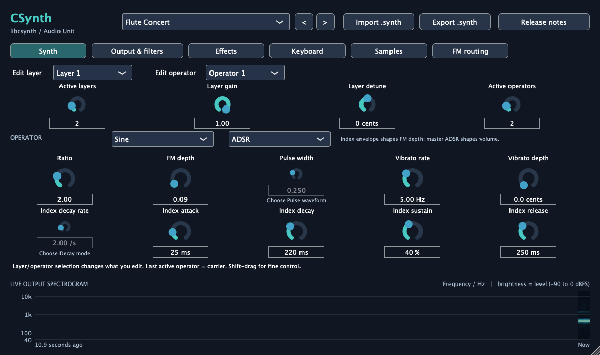
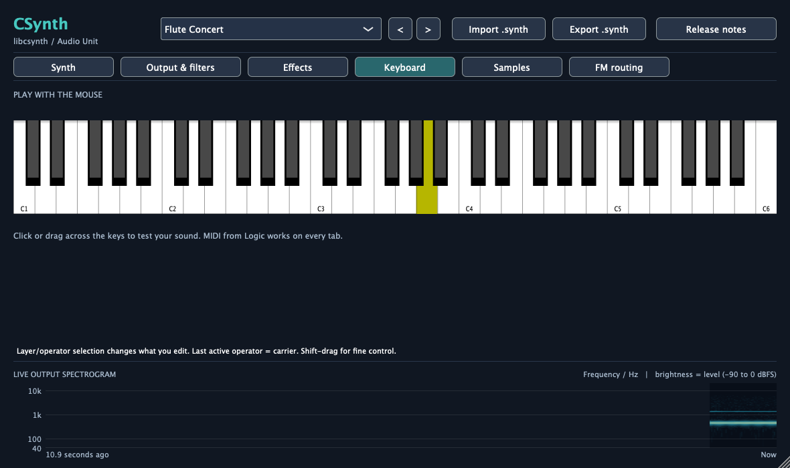
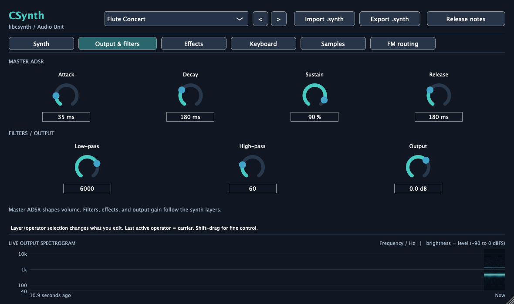
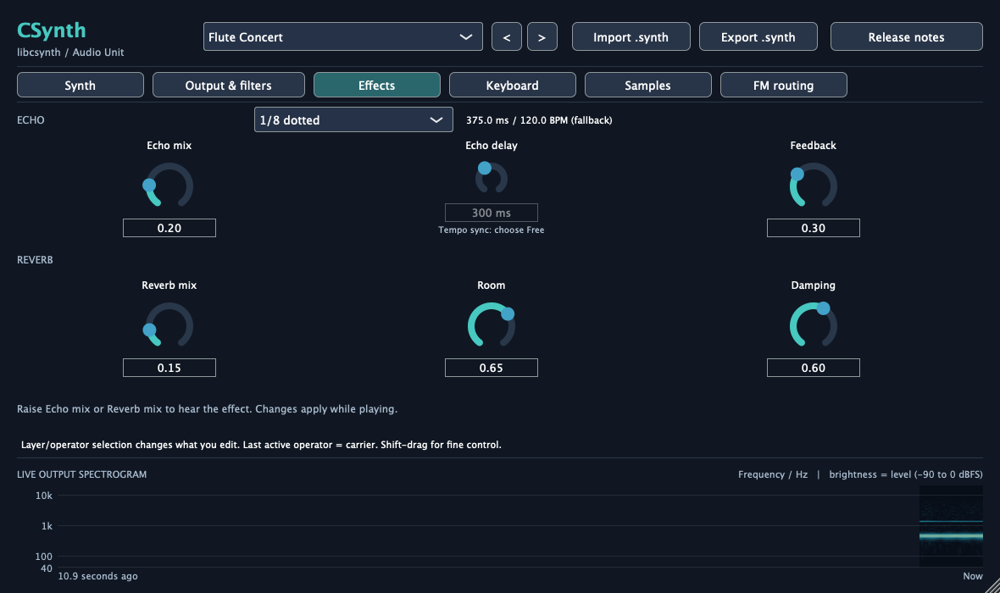
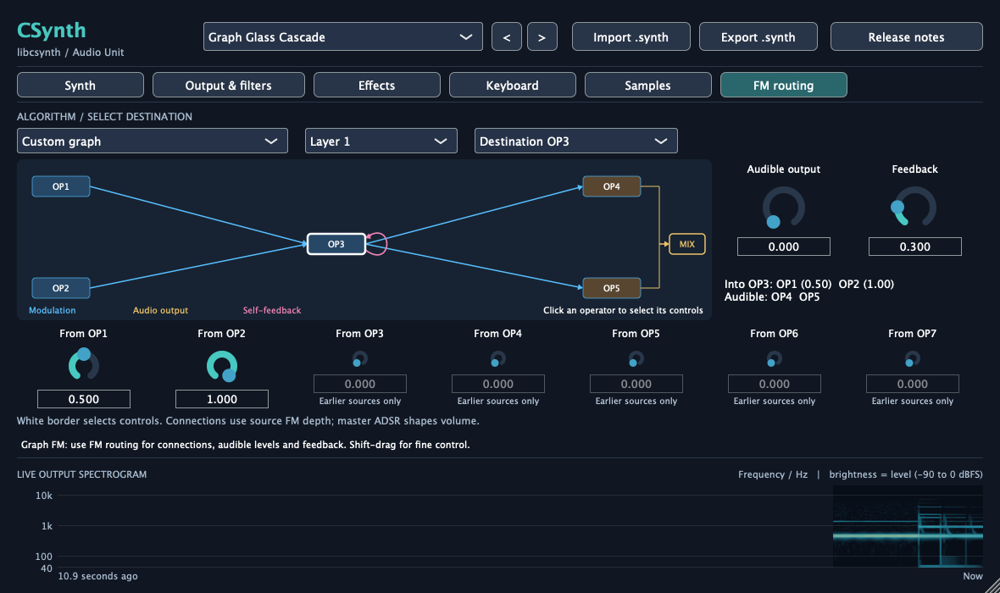
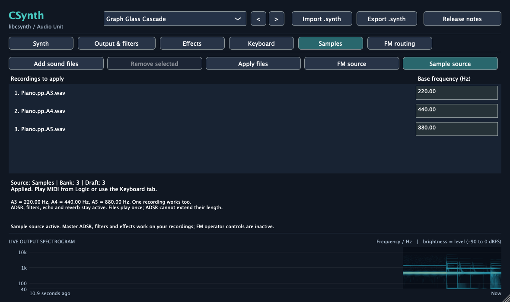

# CSynth for Logic Pro

This is a software-instrument plugin built around
[libcsynth](https://github.com/Ricardicus/libcsynth). It turns MIDI notes into
FM synth audio or a pitched sample instrument, with the sound controls inside
Logic Pro.

The Logic version is an **Audio Unit v2 instrument** called **CSynth**, under
manufacturer **Ricardicus**. The build also creates a standalone app for trying
sounds without a DAW. There is no SDL dependency in this project: Logic supplies
the audio device and MIDI, JUCE supplies the plugin wrapper/editor, and
libcsynth renders the samples.



The screenshots below come from the current editor at its default 1,180 × 700
size. The Samples view uses the three piano recordings described below; all
six tabs share the preset controls and live output spectrogram.

## What you can do

- Choose any of the 72 factory sounds and step through them with the arrows.
- Build a sample instrument from one or several WAV/MP3 files and their recorded
  pitches in Hz.
- Play chords with velocity and a sustain pedal, in either FM or sample mode.
- Edit up to eight layers and eight FM operators per layer, including waveforms,
  FM depth, ratios, modulation envelopes, vibrato, pulse width, gain, and detune.
- Change master ADSR, low-pass/high-pass cutoffs, echo, and reverb while playing.
- Automate the sound controls in Logic. Each layer/operator has its own parameter
  IDs, even though the editor shows one selected slot at a time.
- Watch the final output in a scrolling spectrogram visible on every tab.
- Save a Logic project and get the whole edited patch back when you reopen it.
- Import/export `.synth` files shared with the SDL app.

The engine is mono; the stereo plugin sends the same signal to both channels.
A stereo Logic track is supported, but this does not add stereo width. Place a
Logic stereo effect after it if you want that.

## What you need

- macOS, with an Apple Silicon or Intel Mac.
- Xcode or the Command Line Tools, with the macOS SDK.
- CMake 3.22 or newer, a C/C++ compiler, and Git.
- Internet access for the first JUCE download, unless you supply a local checkout.
- Logic Pro to use the Audio Unit. The standalone app and automated tests do not
  need Logic.

This project targets macOS 11 or newer; Logic itself may require a newer OS.

If you need Command Line Tools, run `xcode-select --install`. If you use Homebrew,
CMake can be installed with `brew install cmake`. With full Xcode, check that
`xcode-select -p` points at the Xcode installation you intend to use.

## Build it

This is its own repository. Clone it with its library dependency:

```sh
git clone --recurse-submodules https://github.com/Ricardicus/logic-plugin-libcsynth.git
cd logic-plugin-libcsynth
cmake -S . -B build -DCMAKE_BUILD_TYPE=Release
cmake --build build --config Release --parallel 4
ctest --test-dir build -C Release --output-on-failure
```

For an existing checkout, run `git submodule update --init --recursive` before
configuring. libcsynth is this repository's submodule at `libcsynth/`. CMake
builds that checkout; Git pins the exact library revision. The SDL project is
not needed. JUCE 8.0.12 is downloaded by CMake at a pinned commit.

To use an existing JUCE checkout:

```sh
cmake -S . -B build -DCMAKE_BUILD_TYPE=Release \
  -DFETCHCONTENT_SOURCE_DIR_JUCE=/absolute/path/to/JUCE
```

To bring in upstream library changes, run these commands from this plugin repo:

```sh
git submodule update --init --remote libcsynth
cmake --build build --config Release --parallel 4
ctest --test-dir build -C Release --output-on-failure
git add libcsynth
git commit -m "Update libcsynth"
```

Build and test afterward, then commit the changed submodule pointer. The current
revision includes filters, samples, graph FM routing and the refreshed factory bank.

The first full build takes longer because JUCE is compiled too. Subsequent
source edits reuse those objects. The build doesn't install anything into your
Library folders automatically.

### Build results

For the commands above, the important files are:

```text
build/CSynth_artefacts/Release/AU/CSynth.component
build/CSynth_artefacts/Release/Standalone/CSynth.app
```

`.component` is the plugin bundle Logic loads. Keep the entire bundle together;
you don't copy just the executable inside it. The standalone `.app` is separate.

To build only the Logic plugin:

```sh
cmake --build build --config Release --target CSynth_AU --parallel 4
```

### Apple Silicon, Intel, and universal builds

The default build targets the architecture of the machine doing the build.
An Apple Silicon build is suitable for native Logic on Apple Silicon; an Intel
build is suitable for Intel Logic or Logic running under Rosetta.

For a bundle containing both architectures, use a separate build folder:

```sh
cmake -S . -B build-universal -DCMAKE_BUILD_TYPE=Release \
  '-DCMAKE_OSX_ARCHITECTURES=arm64;x86_64'
cmake --build build-universal --config Release --parallel 4
```

Check the result with:

```sh
lipo -archs build-universal/CSynth_artefacts/Release/AU/CSynth.component/Contents/MacOS/CSynth
```

Both libcsynth and the plugin wrapper are built for the selected architectures.
CMake signs each completed bundle with an ad-hoc signature.
The default development build is locally signed; it isn't a notarized public
release. For distribution, sign with your Developer ID and notarize/package the
bundle as part of your release process.

## Install it for Logic

Quit Logic before replacing a build, so it doesn't keep the previous binary in
memory. From this project's folder, run:

```sh
./scripts/install-au.sh
```

For another build folder:

```sh
./scripts/install-au.sh ./build-universal
```

The script copies the component to:

```text
~/Library/Audio/Plug-Ins/Components/CSynth.component
```

It installs for your user, without `sudo`. If a CSynth component already exists,
it moves that bundle to `~/Library/Audio/CSynth-backups/` first. It then checks the
new bundle's signature. The build itself never runs this script.

You can do the same in Finder: Go > Go to Folder, enter
`~/Library/Audio/Plug-Ins/Components`, and copy **CSynth.component** there.
Apple documents both the user and system-wide component directories in
[its Audio Units installation-folder guide](https://support.apple.com/en-us/102239).

Do not put the standalone app in the Components folder. It belongs wherever you
normally keep apps. You also don't need to copy libcsynth separately: its code
and factory presets are compiled into the component.

## Load it in Logic Pro

1. Reopen Logic and allow its Audio Unit scan to finish.
2. Open or create a project and add a **Software Instrument** track.
3. In that track's channel strip, open the **Instrument** slot.
4. Choose **AU Instruments → Ricardicus → CSynth → Stereo**. Some Logic versions
   call the Audio Unit submenu **Audio Units**. A mono option is available too.
5. Select the track, play your MIDI keyboard, or open Logic's Musical Typing with
   **Command-K**. CSynth follows MIDI from Logic’s selected instrument track; its Keyboard tab
   also lets you test sounds with the mouse.
6. Pick a factory preset. Try Flute Concert, Keys Tine EP, Bass Rubber FM,
   Pad Aurora, or Bell Singing Bowl.

CSynth belongs in the instrument slot of a software-instrument channel strip.
It doesn't process audio sent through an Audio FX insert. Apple describes the
instrument-slot workflow in [its instrument/plugin guide](https://help.apple.com/logicpro/mac/9.1.6/en/logicpro/usermanual/chapter_10_section_2.html).

Once loaded, you can record MIDI into the track or drag a MIDI file into Logic
and put its region on this instrument track. Logic handles the file playback;
there is no MIDI-file player inside the plugin.

## If it doesn't show up

Open **Logic Pro → Settings → Plug-In Manager** (older versions use
**Preferences**). Find **Ricardicus / CSynth**, check its validation status, and
use **Reset & Rescan Selection** if needed. Make sure it is enabled. Apple's
[Plug-in Manager guide](https://support.apple.com/en-au/guide/logicpro/lgcp9e26ef17/mac)
explains these controls.

For a command-line validation after installation:

```sh
auval -v aumu Csyn Rica
```

The codes are case-sensitive: `aumu` is an instrument, `Csyn` is this plugin,
and `Rica` is the manufacturer. A successful validation should report that the
Audio Unit passed. `auval -a` lists registered Audio Units if you need to check
whether the component has been discovered at all.

If discovery fails:

- Confirm the component is directly inside your Components folder, rather than
  inside another copied directory.
- Quit and reopen Logic after installing/replacing it; restarting macOS can also
  refresh Audio Unit discovery.
- Check architecture with `lipo -archs`, especially if Logic is using Rosetta.
- Check the local signature with `codesign --verify --deep --strict` followed by
  the component path.
- Look for another installed **CSynth.component** in `/Library/Audio/Plug-Ins/Components`
  that could be competing with your user-installed build.

Start with the targeted rescan. There is no need to delete Logic's preferences
or unrelated plugin caches as part of this project's installation.

## Working with the controls

The editor is 1,180 × 700 by default and has six tabs:

| Tab | What it controls |
| --- | --- |
| **Synth** | Layers, gain/detune, and FM operators. |
| **Output & filters** | Master ADSR, lowpass/highpass cutoffs, and output gain. |
| **Effects** | Free or tempo-synced echo, plus reverb. |
| **Keyboard** | An on-screen piano for testing with the mouse. |
| **FM routing** | Per-layer algorithms, custom incoming connections, audible operator levels, and feedback. |
| **Samples** | Recording files, their base frequencies, and FM/sample source selection. |

Presets and the live spectrogram stay visible on every tab. Switching tabs
preserves your edits and does not interrupt audio.



On Keyboard, click or drag across the piano to play. Switching away releases
notes held by the on-screen keyboard. MIDI from Logic and Musical Typing work
on every tab.

The top row chooses a **complete factory patch**. Its arrows wrap at either end.
Factory selection replaces the synth settings and switches the source to FM,
while preserving the Output gain and keeping the sample bank loaded.
The name remains the last chosen factory preset when you edit it; your edits
are still saved in the Logic project. Importing a `.synth` setting shows Custom.



**Output / Master ADSR** controls note volume and final gain in both FM and
sample mode. A filter set to **Off** is bypassed; enter 0 to turn it off. Filter cutoffs run from 20 to
20000 Hz, clamped internally below Nyquist for the host sample rate. The filters
run on the voice mix before echo/reverb, so changing a cutoff doesn't erase
an effect tail that is already ringing.

**Echo / Reverb** controls the shared effects for both sources. Choose **Free
(ms)** for a millisecond delay, or a note division that follows Logic's tempo.

**Edit layer** and **Edit operator** choose which stored slot the controls show.
They don't change the active counts. Turn up Active layers / Active operators
to bring more slots into the sound. Inactive slots keep their settings and are
included in saved state.

In Serial chain mode, the final active operator is the carrier. It has no next operator to modulate,
so its FM-depth controls are disabled. Its index envelope becomes available
when self-feedback is enabled. Graph algorithms can have several carriers and
shared modulators. Modulators shape timbre;
the master ADSR shapes amplitude. Waveforms include noise for breath/texture.

Knobs support dragging, wheel changes, and typing into their value boxes.
Shift-drag provides fine control. **Release notes** releases the held MIDI notes;
the configured release and effect tails still finish normally.

Disabled operator controls show a reason below the knob. For example, pulse
width asks you to choose Pulse, and index-envelope knobs ask for Decay or ADSR
mode. An operator with no outgoing route has no FM depth to edit. Add a route or
feedback to use its index envelope; see FM routing below. Hover a control’s label or
reason for the full explanation. These hints update when you change the selected
operator, waveform, envelope mode, preset, or source. In sample mode, FM-only
controls say **Sample source: FM only**; master ADSR, filters, effects, and
layer gain/detune remain available.



On the Effects tab, **Echo timing** offers **Free (ms)** plus 1/32, 1/16, 1/8,
1/4, 1/2, and whole-note divisions, each straight, dotted, or triplet. Synced
notes follow the project tempo, including tempo changes. A dotted note is 1.5
times the straight length; a triplet is two-thirds. At 120 BPM, a quarter note
is 500 ms and a dotted eighth is 375 ms. These are note values, not fractions
of a bar, so a quarter stays a quarter when the time signature changes.

Free mode keeps the existing 1–2,000 ms knob. In sync mode that knob shows why
it is disabled, and the readout beside the menu shows the actual delay and tempo.
Switching back to Free restores the millisecond value you left there. Without
host tempo, sync starts at 120 BPM; once a valid tempo arrives, the last valid
value is retained if the host stops reporting it. Delays are limited to 1 ms–30
seconds, with a visible limit notice when necessary. Changes are smoothed and
may briefly bend the pitch of an existing echo tail.

Echo timing is automatable and saved in Logic projects/plugin settings. Older
project states open in Free mode. Factory presets and `.synth` imports select
Free; `.synth` export stores the free millisecond patch, since the shared format
has no host-tempo division field. Use Logic settings to preserve sync mode.

The live spectrogram shows the final signal after filters, effects, and output
gain. Time runs left to right (newest at the right), frequency runs bottom to
top on a logarithmic scale, and brighter colours mean stronger frequency bins.
The display spans 40 Hz to 20 kHz, capped by the current sample rate’s Nyquist
frequency. Its 2,048-sample Hann-windowed FFT uses 50% overlap and a 30 Hz UI
timer. At 48 kHz, the history covers about 10.9 seconds.

The audio thread only copies samples into a fixed-size queue while an editor
exists. FFTs and drawing run on the UI thread, and closing the editor disables
capture. If the UI falls behind, visualization data is discarded; audio never
waits for the display. The spectrogram is not stored with your patch.

## FM routing

The diagram follows the selected preset and layer: blue arrows show modulation,
gold paths show operators feeding the audio mix, and pink loops show self-feedback.
Click an operator to select its controls; its white border and highlighted routes
show what you are editing. Changing presets, algorithms, operator counts, routing,
output levels or feedback updates the diagram, including changes from automation.
In sample mode it labels the FM graph as inactive.

Open **FM routing**, choose a layer and destination operator, then choose an
algorithm. Active layers/operators are still set on **Synth**.

- **Serial chain** keeps the original sound: OP1 → OP2 → … → the last carrier.
- **Parallel pairs** makes independent two-operator stacks in the same layer.
- **Modulators to carrier** sums every earlier operator into the last one.
- **Shared modulator** sends OP1 to every later carrier.
- **Additive carriers** mixes independent operators without inter-operator FM.
- **Custom graph** lets each earlier operator feed the selected destination.

The **From OP** knobs scale incoming connections. The source operator's FM
depth and index envelope scale its modulation; adjust those on Synth.
**Audible output** controls this operator's contribution to the normalized
carrier mix. Serial mode fixes the last carrier at unity for compatibility.
**Feedback** feeds the operator's previous output into its own instantaneous
frequency. Start low: this is frequency feedback, not phase modulation, and
high feedback/depth can alias. Index envelopes shape feedback as well as
outgoing modulation; master ADSR still controls note volume.

Connections only run from earlier to later operators; reorder your design
rather than creating a cycle. A custom operator can both modulate and be
heard. Muted carrier levels are allowed; the graph readout shows the actual
connections and audible operators. Sample mode disables these FM controls
with an explanation. Algorithms, routes, output levels, and feedback are
host-automatable and saved with Logic projects and version-3 `.synth` files.
Older project states and v1/v2 files restore as serial chains with no feedback.

Eight new presets demonstrate the choices: **Graph Tine Duo**, **Graph Prism
Bell**, **Graph Hollow Reed**, **Graph Air Choir**, **Graph Feedback Bass**,
**Graph Glass Cascade**, **Graph Drawbar Organ**, and **Graph Orbit Texture**.
The previous 64 preset indices are preserved.



## Sample instruments



A sample instrument starts with a recording of a known note. You tell CSynth
which pitch is in the file; it then plays the recording faster or slower to
produce the MIDI notes you send it. The **Base frequency (Hz)** field describes
the recording, not the note you want to play next. You only set it once per
file, unless the original pitch was wrong.

### Set up your three piano recordings

Keep the recordings in a folder you plan to leave in place, then:

1. Open **Samples** and click **Add sound files**. The picker accepts one file
   or several at once; choose your three WAVs together.
2. Click each Hz field and enter the pitch from this table. Clicking selects
   the current text so you can replace it; Enter finishes editing.
3. Click **Apply files**. The source changes to **Sample source**, and the
   bank count becomes 3.
4. Play MIDI from Logic or use the **Keyboard** tab. Return to **Output &
   filters** to set master ADSR, and **Effects** for echo or reverb.

| Recording | Recorded note | Base frequency (Hz) |
| --- | --- | ---: |
| `Piano.pp.A3.wav` | A3 | 220.00 |
| `Piano.pp.A4.wav` | A4 | 440.00 |
| `Piano.pp.A5.wav` | A5 | 880.00 |

These use A4 = 440 Hz (MIDI note 69). Some apps number octaves differently;
the actual frequency is what matters. For a recording tuned away from concert
pitch, enter its measured frequency instead. The filename is just a label:
CSynth does not infer pitch from `A3`, analyze the sound, or retune a recording
before loading it. New rows start at **440.00**, so check every row.

One file is enough. With only A4 at 440 Hz, MIDI A4 plays at its original
speed, A5 plays twice as fast, and A3 plays at half speed. Pitch changes also
change the recording's duration and timbre. With the three files above,
CSynth can use the original A3/A4/A5 recordings at those notes and transpose
from a closer recording between them. More recordings across the keyboard
usually preserve a piano's character better than stretching one file over
several octaves.

### Choose and edit the bank

The list scrolls when it grows beyond the visible rows. Click a filename to
select it, then **Remove selected** to remove it from the draft. Hz fields
accept decimals. Frequencies must be finite, at least 1 Hz, and no higher
than half that file's sample rate. An invalid value or unreadable file reports
the failing row.

The **draft** is the list you are editing; the **bank** is what currently makes
sound. Adding/removing files or changing Hz does not alter the playing bank
until you press **Apply files**. Applying loads the whole draft as a replacement,
not as extra recordings added to the previous bank. If any row fails, the
previous bank keeps playing. Removing a draft row does not delete its audio
file from disk.

**FM source** switches back to the oscillator instrument. **Sample source**
returns to the applied bank without decoding it again; it is disabled until
there is a valid bank. Factory presets select FM, but retain that bank, so you
can switch back. **Import .synth** changes the processing settings while
keeping the current source.

### What happens when you play

For each layer and MIDI note, libcsynth selects the recording whose base
frequency is closest in semitones. It adjusts playback speed by the target
frequency divided by that recording's base frequency, accounting for the
file's sample rate and Logic's audio rate. Linear interpolation reads between
source frames. Layer detune affects both the target pitch and recording choice.
There are no manually assigned key ranges or crossfades between recordings.

MIDI velocity controls volume; it does not choose a different recording.
For example, `pp` in your piano filenames describes how those notes were
recorded, but CSynth does not interpret it as a velocity zone. Playing harder
makes that same quiet-piano recording louder. Velocity layers, round-robin
selection, and separate release samples are not implemented.

The signal follows this path in sample mode:

```text
Recording selection and pitch -> layer gain + master ADSR + MIDI velocity
    -> mix layers/notes -> highpass -> lowpass -> echo -> reverb -> output gain
```

**Active layers**, **Layer gain**, and **Layer detune** still work. Each layer
uses the same bank, with its own pitch and playback position. FM operator
waveforms, ratios, FM depth, vibrato, and index envelopes do not process the
recordings; their controls explain that they are FM-only. Use the master ADSR
on **Output & filters** for the sampled note's volume envelope.

The plugin loads files as **one-shots**: playback stops at the end of a
recording, even if the key is still held. Master attack/decay/sustain scale the
recorded sound, and release fades it after note-off. Sustain cannot make a
short file longer, and a long release cannot recover audio after the file has
ended. Echo and reverb can continue after the source stops. For a piano,
start with a short master attack, high sustain, and a release that lets go
naturally; the recording already contains its own attack and decay.

WAV and MP3 are supported, with mixed sample rates; multichannel audio is
mixed down to mono. Up to **128 recordings** and **256 MiB of decoded mono
float audio** fit in a bank. Compressed MP3 size is not its decoded memory
size. WAV is a useful starting point for preserving transients without lossy
compression. Loading happens when you click Apply, outside the render
callback; a large bank may take a moment to decode.

libcsynth itself supports looping banks and `.csamples` maps, as described in
[its sample documentation](libcsynth/README.md).
The current plugin picker accepts **WAV/MP3 recordings**, not `.csamples`
maps, and the plugin has no loop-point editor. The piano map used by the SDL
app is not needed here: enter the same three frequencies in this list.

### Save it with a Logic project

Logic's project state saves the **applied** file paths and frequencies, the
current source mode, the separate editing draft, and the synth's processing
parameters. Reopening the project loads the applied bank again; unapplied
draft edits remain unapplied. Closing/reopening the plugin window keeps both
lists, and audio-device/sample-rate changes retain the loaded bank.

Recordings are referenced by **absolute path**, not embedded in the project
or copied into Logic's project assets. Keep them in a stable folder. When
moving a project to another Mac, copy the recordings too; if their paths
change, remove the old draft rows, browse to the new files, set their Hz, and
apply again. Keep a note of the frequencies if you organize the files later.

If an applied recording is missing when a project opens, the Samples tab
shows the loading error and the plugin falls back to FM. Restore the original
path, or rebuild the draft at its new location and apply it. A `.synth` export
contains processing settings only; it does not contain the sample list,
source mode, or audio files. Use Logic's project/plugin settings to preserve
the complete sample-instrument setup, together with the external recordings.

## Saving sounds and projects

Saving the Logic project stores the complete parameter state for each plugin
instance, including all inactive layers/operators, filters, effects, and Output
gain. It also stores the sample-instrument source, applied bank references,
and editing draft. Reopening does not need an exported `.synth` file, but a
sampled instrument does need its referenced recordings to remain accessible.
You can also use Logic's plugin settings menu to save/recall a setting for reuse
in other projects.

**Import .synth** reads settings saved by the SDL app or libcsynth. Version 1
files load with filters off; version 2 includes filter cutoffs; version 3 adds
FM routing, carrier levels, and feedback. Export writes v3, so older library
builds need updating to read these files. Values beyond
this plugin's parameter ranges are clamped to the supported range.

**Export .synth** writes the synth patch to a new file. Its name is derived from
the filename using up to 32 ASCII letters/numbers, spaces, hyphens, and
underscores. It refuses to overwrite an existing setting, so choose a new
filename for each revision. This format contains the libcsynth patch; the
plugin-only Output gain is saved by Logic rather than in `.synth` files.

## Automation and MIDI behavior

Press **A** in Logic to show track automation, then select a CSynth parameter
from the track's automation menu. Master controls have names such as Low-pass
cutoff. Layer controls have names such as Layer 1 OP2 FM depth. The editor's
layer/operator selection isn't itself a sound parameter: choosing another slot
doesn't retarget an automation lane you've already recorded.

Master ADSR, filters, effects, layer gain/detune, and output gain automation
also work in sample mode. The recording list, Hz fields, Apply button, and
FM/sample source switch are saved settings, not host automation parameters.

Parameter changes reach the engine at audio-block boundaries. MIDI note and
sustain events split the block at their sample offsets, so notes aren't all
rounded to the start of a buffer. Filter, effects, velocity, and Output gain
changes are smoothed. Not every waveform/chain change can be made without a
click; those edits change the underlying waveform/structure directly.

All 16 MIDI channels use the current patch, including channel 10. Sustain is
handled per channel, and overlapping channel holds of the same pitch don't
cut each other off. Repeated note-ons at the same pitch are legato, following
libcsynth's one-voice-per-pitch model. Pitch bend, MPE, aftertouch, modulation-wheel
mapping, MIDI-clock sync, and general MIDI program-change messages aren't
implemented in this first version. Note-off, sustain, reset controllers, and
all-notes/all-sound-off messages release their holds; amplitude/effects tails
follow the patch. This isn't a General MIDI instrument bank.

Large layered patches across many notes use more CPU. If playback crackles,
reduce active layers/operators or raise Logic's audio buffer size. Some very
high FM ratios/depths and raw saw/pulse/square waveforms can alias. Lower Output
gain if chords are too loud; the core also has its own final clipping stage.

## Try the standalone app

Open:

```sh
open build/CSynth_artefacts/Release/Standalone/CSynth.app
```

Choose an audio output and MIDI input in its Options/settings panel. Play a MIDI
keyboard, or click the piano on the Keyboard tab. This is a convenient way to check the
synth without waiting for Logic's plugin scan. The app doesn't need SDL.

## Development and tests

```sh
cmake --build build --config Release --parallel 4
ctest --test-dir build -C Release --output-on-failure
```

These checks need a normal macOS process: a restricted sandbox may prevent
`AudioComponentRegister` from registering the test component. Run CTest outside
such a sandbox. The tests do not install the plugin.

The processor test covers MIDI sample offsets, sustain, overlapping channels,
state restoration (including inactive operators), independent instances, every
factory preset, and constructing the editor. It also covers sample loading,
Hz editing/apply in the editor, single/multiple recordings, live ADSR and
filter changes, effect tails, source switching, missing-file errors, and
restoring applied banks independently of their drafts. The Audio Unit test loads the built
component directly, creates an instrument instance, renders MIDI, and round-trips
its AU state. It doesn't install the plugin into your Library.

That direct-load test isn't a substitute for Logic's own validation and a play
check in a real project. After installing a changed build, run `auval` and rescan
in Logic. Test saving/reopening a project and a bounce before relying on a build
for a session.

The Audio Unit identity is in `CMakeLists.txt`: bundle ID
`com.ricardicus.csynth`, manufacturer `Rica`, subtype `Csyn`, and export prefix
`CSynthAU`. Keep these stable when updating a plugin that existing Logic projects
use. Parameter IDs are also stable state/automation identifiers; changing them
can break old settings and automation.

`Source/Parameters.cpp` maps libcsynth fields to host parameters.
`Source/PluginProcessor.cpp` owns the engine and handles audio/MIDI/state.
`Source/PluginEditor.cpp` builds the tabbed UI; `Source/SamplePanel.h` handles
recording selection and base-frequency editing. Ordinary parameter changes
reach the engine on the audio thread. Recording decoding happens on the
calling control thread outside the callback lock; bank replacement and source
switching take that lock to exclude rendering.

The plugin has its own Git history and remote. Its `.gitmodules` registers
libcsynth from upstream; the submodule pointer records the version tested with
this plugin. Develop library features in the libcsynth repository, publish them
there, then update this dependency. This keeps upstream as the source of truth
while letting the plugin and SDL app choose when to adopt a new revision.

## Distribution

This is a source/development project, not a signed public installer. JUCE is
dual-licensed; choose a suitable licence for how you distribute the plugin.
See [the pinned JUCE version's licence](https://github.com/juce-framework/JUCE/blob/8.0.12/LICENSE.md)
and the libcsynth repository's terms. Code signing/notarization and any release
licensing decisions belong in the distribution process.

### Checked build

The native arm64 Release build passed both processor and Audio Unit tests.
The AU test loaded the built component, rendered offset MIDI, and restored its
state. The AU and standalone bundles also passed `codesign --verify --deep
--strict`. The tab screenshots come from the current editor, rendered directly
without installing the AU. Logic itself still needs the installation and manual check described above; the automated
test does not replace Logic’s scan or `auval`.

The plugin build defines `CSYNTH_ECHO_MAX_DELAY_MS=30000` for libcsynth and
its clients. This uses about 5.8 MB for the echo buffer at 48 kHz, allocated
once when the engine starts. The pinned submodule supports this capacity
option. Ordinary library builds still default to 2,000 ms.

### Refresh the README screenshots

With `BUILD_TESTING=ON`, build the editor capture tool and point it at the
folder containing `Piano.pp.A3.wav`, `Piano.pp.A4.wav`, and `Piano.pp.A5.wav`.
From the plugin repository:

```sh
cmake --build build --target CSynthScreenshots --parallel 4
./build/CSynthScreenshots docs /path/to/piano-recordings
```

It writes `editor.png`, `output.png`, `effects.png`, `keyboard.png`, and
`samples.png`, and `routing.png` using the real plugin editor, with rendered audio feeding the
spectrogram. It does not install the plugin or open Logic. The capture tool
only needs those recordings when generating the Samples view; building the
plugin itself does not depend on these particular piano files.
